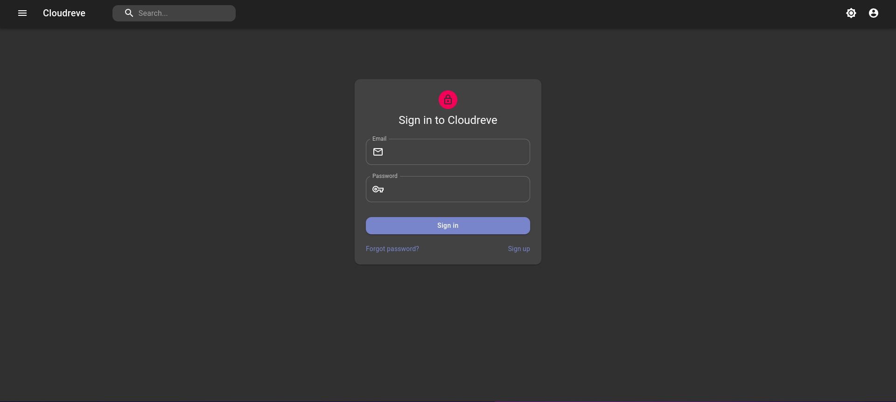
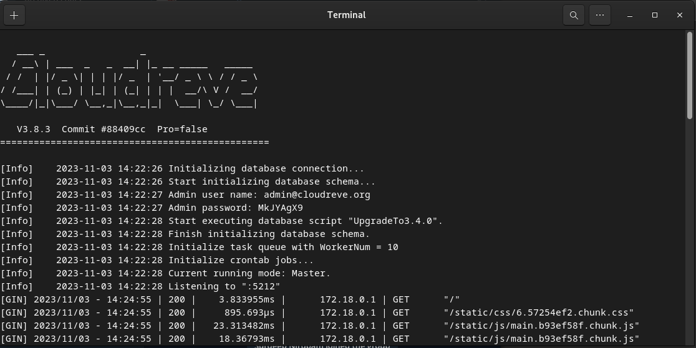

## This config for cloudreve



Link Documentations : [cloudreve](https://docs.cloudreve.org/v/en/)

## 1. Install docker and docker-compose

## 2. Clone this repo

## 3. Start cloudreve

```bash
make start
```

- Default port: 5212
- Default username: admadmin@cloudreve.org
- Default password: You need to check in log docker with command below

```
docker logs cloudreve
```

<!-- Sample docker logs -->


<br>

## 4. Stop cloudreve

```bash
make stop
```

## 5. Remove cloudreve

```bash
make remove
```
